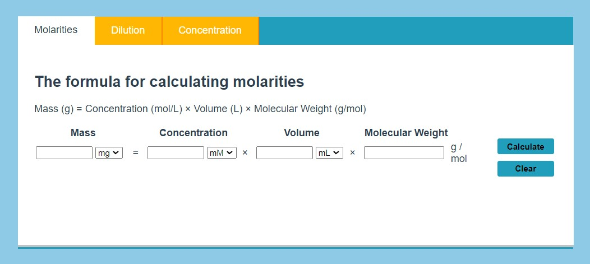
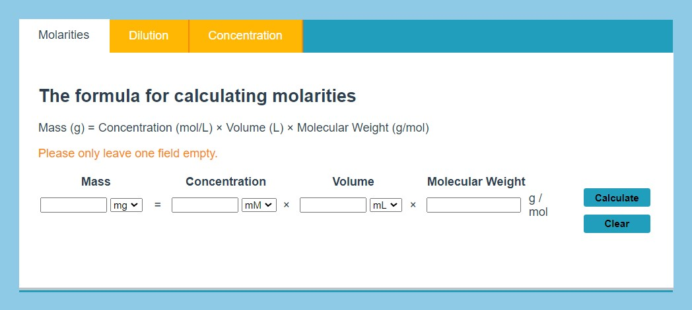
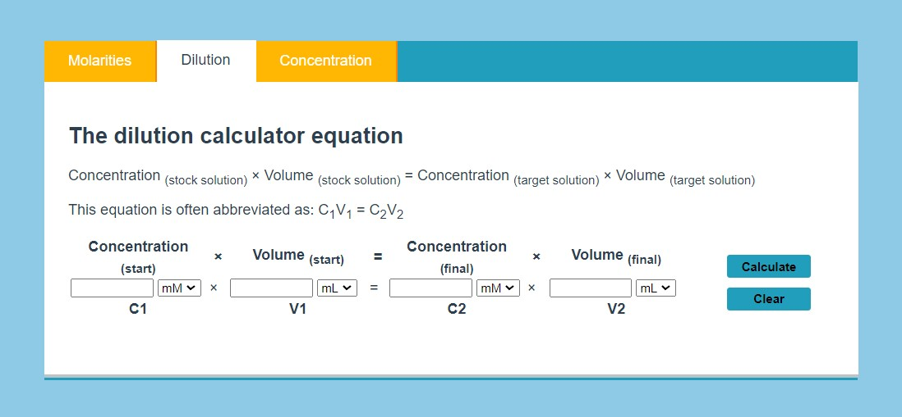
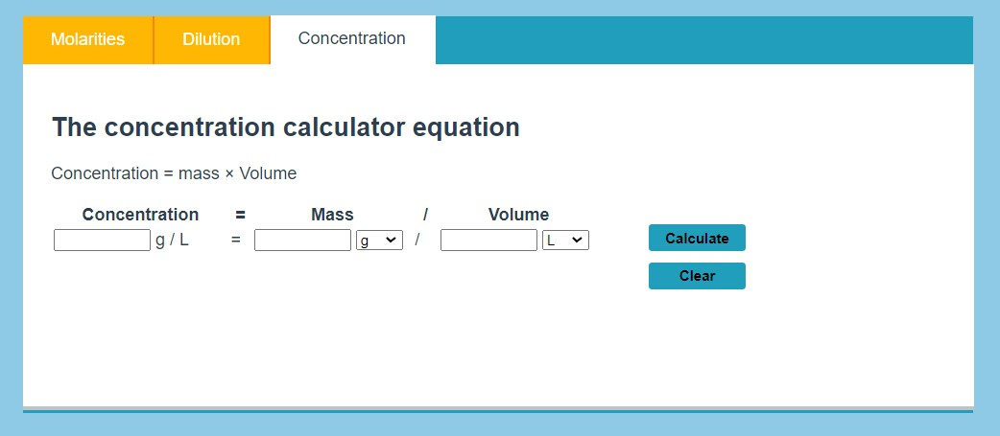
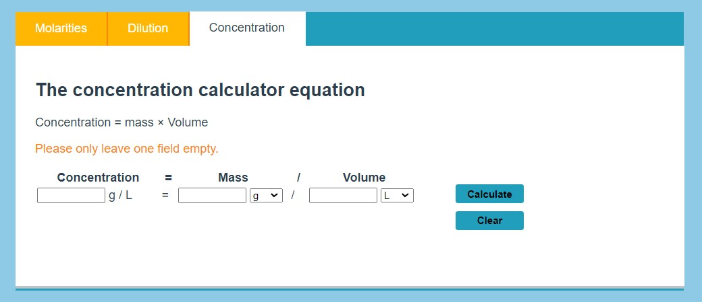

# Formula for calculating molarities & dilutions & concentration
The formula consists of two tabs:
1. [Calculate Molarities](#formula-for-calculating-molarities)
2. [Calculate Dilutions](#formula-for-calculating-dilutions)
3. [Calculate Concentrations](#formula-for-calculating-concentrations)

## Formula for calculating molarities

This is a simple calculation tool for calculating:
- Mass
- Concentration
- Volume
- Molecular Weight

The formula calculates the value and unit for the empty field.

If more than one field is left empty, it shows an error message:

The formula features two buttons:
- `Calculate` (Calculates empty field value and unit)
- `Clear` (Clears all field values and resets the units)

## Formula for calculating dilutions

This is a simple calculation tool for calculating:
- Concentration (start)
- Volume (start)
- Concentration (final)
- Volume (final)

The formula calculates the value and unit for the empty field.

If more than one field is left empty, it shows an error message:

The formula features two buttons:
- `Calculate` (Calculates empty field value and unit)
- `Clear` (Clears all field values and resets the units)

## Formula for calculating concentrations

This is a simple calculation tool for calculating:
- Concentration
- Mass
- Volume

The formula calculates the value and unit for the empty field.

If more than one field is left empty, it shows an error message:

The formula features two buttons:
- `Calculate` (Calculates empty field value and unit)
- `Clear` (Clears all field values and resets the units)